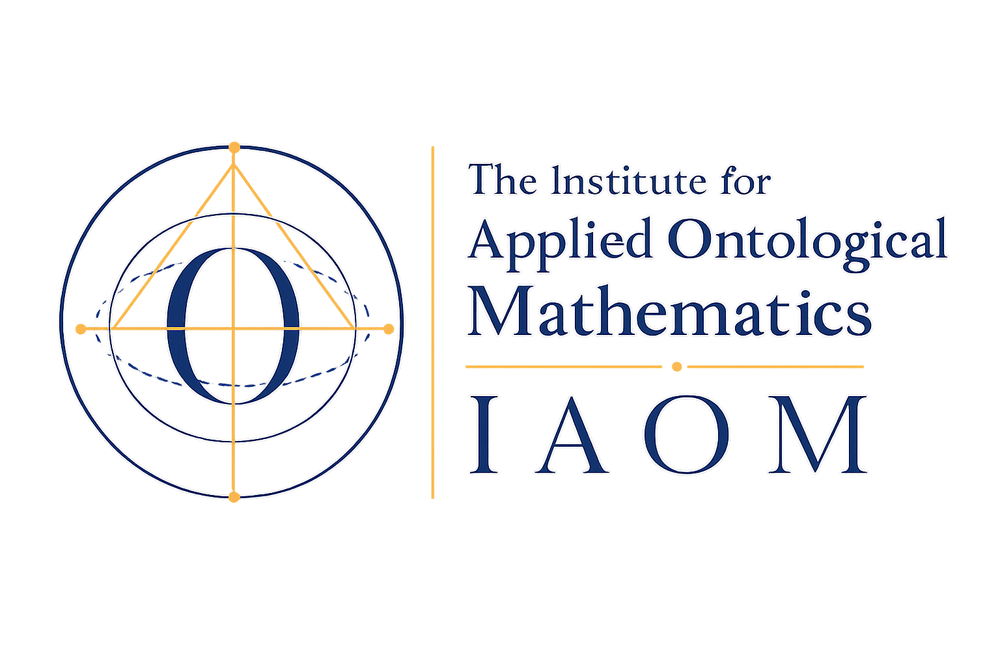

<div align="center">



<h1>Every Limit a Corridor</h1>
<h3>A Constructive Engine for Effective Mathematics</h3>

<p>
  <a href="https://www.apoth3osis.io/IAOM"><b>Institute for Applied Ontological Mathematics</b></a>
  &nbsp;·&nbsp; June 2026
</p>

<p>
  
  
  
  
  <a href="paper/paper.pdf"></a>
</p>

<p><i>Replace the limit-as-a-dumb-point with a <b>corridor</b> — a two-sided bracket carried as data,<br/>narrowing at a forced golden rate — verifiable from primitives and lowered to bare metal.</i></p>

</div>

---

A self-contained, verifiable bundle for the paper **"Every Limit a Corridor: A
Constructive Engine for Effective Mathematics"** (Institute for Applied
Ontological Mathematics, June 2026).

The paper realizes Veselov's *spectrum-with-a-modulus* proposal — a point-free
ladder, a spectral corridor, and computability certificates — as one object in
**cohesive homotopy type theory**, measures it, and **lowers it to bare metal**
(extracts each construction to an interaction-net program, ready for the reducer).
This bundle lets a professional **verify every claim from primitives** and
**reuse** the constructions.

> **Scope, stated plainly.** What is verified here: the seven constructions
> kernel-check under `--cubical --safe` with no postulates; the key computation
> (the univalence transport) *reduces* in the kernel; the witnesses *lower* to
> bare-metal programs; the closure lane accepts the genuine evidence and rejects
> every degenerate variant. What is **not** claimed: a completed interaction-net
> reduction of the lowered programs to a normal form — that is the substrate's run,
> which the lowered programs are prepared for.
>
> **From germ to organism (since first release).** The three completions the paper
> named as future work have since been carried out and kernel-checked, in eighteen
> further modules under `agda/corpus/cubical_agda/RealCohesion/` (all `--cubical
> --safe`, postulate-free; their joint typechecking is forced through the single
> capstone `CorridorOrganism.agda`, and `verify.sh` runs it): **(1)** the genuine
> analytic Dedekind real line `R` — shape ≠ flat on `R` itself, not its two-point
> witness; **(2)** the golden value as a located, **irrational** real `phi:R` with
> its located Galois conjugate `psi`, the two provably apart, `phi` bracketed by
> consecutive Fibonacci convergents at the golden-modulus width, and `phi`
> irrational by infinite descent (both roots ruled out); **(3)** a tower of genuine
> matrix `*`-algebras over `Z[phi]` with a Bratteli AF limit and a complete
> `C*`-norm on its commutative core, **and** the non-commutative operator
> (house) norm of every finite `M_n(Z[phi])` reached as a located real through
> the regular representation (`Corridor/Running/General/ZPhiOperatorNorm.agda`:
> a golden integer `a+b·phi` acts on the basis `(1,phi)` as `[[0,1],[1,1]]`, so
> `M=(A,B)` becomes the `2n×2n` rational symmetric Gram matrix whose located
> spectral radius is the existing rational operator norm — no `Q[phi]`
> C\*-convergence to re-derive).
>
> **Closed since the peer-review round (new modules under `agda/corpus/cubical_agda/Theory/`).**
> A reviewer's critique drove three further kernel-checked additions, each `--cubical
> --safe`, postulate-free, with a kernel-rejected control (`verify.sh` runs them, §1d/1e):
> **(a)** the `C*`-completion of the non-commutative *limit* as one object — once named
> future work — is now closed: `CStarInductiveLimit` (the inductive limit as a single
> sequential colimit, norm + `C*`-identity descending), `CStarCompletion` (its metric
> Cauchy completion, *proved complete* with a dense isometric embedding), and
> `CStarCompletionAlgebra` (the operations and the `C*`-identity *extend* to the
> completion) — so the AF limit is a complete `C*`-algebra, no residual; **(b)** the
> cohesion-vs-metric *discriminator* `CohesionMetricSeparation` (shape ≠ flat on the
> cohesive line, a separation the metric language cannot state); **(c)** the
> `LogicalEntropyTEEBridge` — the formal first step of the `H^1` frontier — proving the
> Ellerman logical entropy of the Fibonacci quantum-dimension distribution is exactly
> `2/5` and the total quantum dimension `D^2 = 2+phi`, bridging the screen's currency to
> the (measurable) topological entanglement entropy.
>
> **Still open.** The chief frontier is the *empirical* reading of the `H^1` screen —
> identifying "spectral divergence" with a measured spectrum and confronting the
> `nu=12/5` FQHE / string-net data (the formal observable-bridge is now in place); and
> the rational rung at `ρ=3/2` (the Mahler `3/2` boundary, an open Diophantine question).
> See the paper, §10 (*From germ to organism*) and the Discussion.
>
> **Companion paper.** The wheel / Tower-of-√−1 / quantum-atlas / operadic development
> (the golden wheel, the Cayley–Dickson degradation ladder, the associahedra, and an
> `A_infinity` structure, with an axiom-free Lean 4 cross-kernel mirror) is split into a
> companion, *The Golden Wheel: Zero, Infinity, and the Quantum Atlas*.

## What is here

```
verify.sh        re-checks everything from primitives (math + negative control + lane)
agda/corpus/cubical_agda/   the genuine constructions, cubical Agda (--cubical --safe, no postulates)
  Foundations/FiniteCohesion.agda        faithful real-cohesion: shape != flat (Thm 3.1-3.2)
  Corridor/CrossingCorridor.agda         univalence that computes: the re-entry (Thm 4.1)
  Corridor/FaithfulModulus.agda          "the ladder is the rate": golden modulus (Thm 5.1-5.2)
  Corridor/GoldenAFColimit.agda          Z[phi] AF Bratteli skeleton (Thm 6.1)
  Corridor/EntropyScreen.agda            H^1 logical-entropy screen (Thm 6.2)
  Corridor/FaithfulCorridor.agda         the two walls, unified
  Corridor/CompleteCorridor.agda         synthesis + cross-part identity (Thm 7.1)
  Corridor/negative_controls/            BadForcedTrueCollapse.agda  (kernel-REJECTED control)
  HottLane/                              supporting genuine univalence (primGlue ua, the crossing)
  Theory/GoldenRing.agda                 Z[phi]: phi^2=phi+1, Fibonacci, the golden minimal polynomial
  Theory/CStarInductiveLimit.agda        the inductive limit as one object; norm + C*-identity descend
  Theory/CStarCompletion.agda            its metric Cauchy completion, proved COMPLETE + dense embedding
  Theory/CStarCompletionAlgebra.agda     operations + C*-identity extend to the completion (no residual)
  Theory/CohesionMetricSeparation.agda   the cohesion-vs-metric discriminator (shape != flat, metric-free)
  Theory/LogicalEntropyTEEBridge.agda    H^1-screen <-> TEE: logical entropy 2/5, D^2=2+phi (frontier i)
  Theory/*NegativeControl.agda           the five kernel-REJECTED controls for the above
  RealCohesion/CorridorOrganism.agda     ★ ORGANISM CAPSTONE: the three completions (transitively typechecks 18 modules)
  RealCohesion/DedekindReal.agda         the genuine analytic real line R (Dedekind cuts of Q)
  RealCohesion/ShapeNullification.agda   shape != flat on the analytic R itself (D3, overcome)
  RealCohesion/GoldenCut.agda            phi:R as a located real (8-law Dedekind cut, golden quadratic)
  RealCohesion/GoldenConjugate.agda      psi=1-phi, the conjugate located root; phi # psi (the spectral pair)
  RealCohesion/GoldenIrrational[Z].agda  phi irrational: no integer ratio a^2=aB+B^2 (infinite descent)
  RealCohesion/GoldenSpectrum.agda       the two-sided golden modulus (reaches any precision, never collapses)
  RealCohesion/{GoldenMatrixAlgebra,GoldenAFAlgebra}.agda   matrix *-algebras M_n(Z[phi]) + Bratteli AF limit
  RealCohesion/DiagonalCStar.agda        a complete C*-norm on the commutative core (C*-identity, submult, triangle)
  RealCohesion/negative_controls/        BadTrisection, BadQuadMono, BadCStarNonneg (kernel-REJECTED)
realization/     the bare-metal authority lane
  verify_lane.py                         STANDALONE: vendored validator, 23 accept/reject checks
  agda_boundary_runtime_roundtrip.py     producer: runs positive + negative controls, emits the artifact
  test_agda_runtime_roundtrip_authority.py   full 27-check suite (imports claim_gate; full-repo)
  phase_a11_crossing_genuineness_oracle.py   compiles all 7 modules + checks discriminators
  agda_runtime_roundtrip.json            the executable-form closure artifact (boundary.agda_runtime_roundtrip.v1)
  manifest.json                          registers the artifact as boundary_runtime authority
artifacts/
  boundary_metal/                        the bare-metal Boundary programs ({decls, main} term trees, 84 nodes)
  closure/                               the executable-with-receipt transition + fixed-point-stability receipt
paper/           paper.tex, paper.pdf (25pp), refs.bib, build.sh, figures/
```

## Dependencies

- **Agda 2.8.0** (`agda --version`).
- **The cubical Agda library** (`agda/cubical`), pin `d684d7d8`. The modules import
  `Cubical.*` (set-quotients, the circle, sequential colimits, `Bool`, `Nat`).
  Obtain it with `git clone https://github.com/agda/cubical` and check out the pin,
  then point Agda at it (see `verify.sh`).
- **Python 3** (for the realization lane).
- **pdflatex + bibtex** (only to rebuild the paper).

## Verify the mathematics (no trust required)

Every numbered theorem in the paper is the plain-mathematics image of one
kernel-checked declaration here. To re-check them:

```bash
./verify.sh /path/to/cubical          # compiles all 7 modules --safe; confirms the
                                       # negative control is kernel-REJECTED; runs the
                                       # standalone lane discrimination (23/23)
```

`verify.sh` does three independent things, all standalone:

1. **Compile** each of the seven modules under `agda --cubical --safe` with **no
   postulates** — the Agda kernel checks the proofs (and reduces the univalence
   transport of the re-entry).
2. **The negative control**: confirms `BadForcedTrueCollapse.agda` is *rejected* by
   the kernel for the genuine reason (`true != false`) — a degenerate witness
   cannot manufacture the discriminator.
3. **The authority lane discriminates**: `realization/verify_lane.py` vendors the
   engine's outcome validator (a pure 30-line function) and confirms it **accepts**
   the genuine artifact and **rejects** every degenerate / spoofed / tampered
   variant (23 checks), with the bare-metal programs present and non-trivial on
   disk.

The full 27-check suite (`test_agda_runtime_roundtrip_authority.py`) additionally
replays the producer end-to-end (T13/T14); it imports the engine's `claim_gate.py`
and so runs from the full repo. The lane's *discrimination* — the part that matters
for trust — is re-checked standalone by step 3 above.

## Reuse

The seven modules are ordinary cubical-Agda modules: import them and build on the
two walls, the computing re-entry, the forced modulus, the colimit, or the screen.
The realization lane is a template for admitting any kernel-checked cubical-Agda
construction as executable-form closure authority, gated by a kernel-enforced
negative control (the lowering and its discriminator are certified; a completed
interaction-net run is the substrate's, which the lowered programs are ready for).

## The paper

`paper/paper.pdf` (25 pages). Rebuild with `cd paper && ./build.sh`.

---
## License

This research package is provided under the **Apoth3osis License Stack v1** (see
[`LICENSE.md`](LICENSE.md) and [`licenses/`](licenses/)): a tri-license — the
**Public Good License** (free for open-access public-good use), the **Small Business
License**, and the **Enterprise Commercial License** — Licensor *Equation Capital LLC
DBA Apoth3osis*. **Commercial use is additionally governed by the [Apoth3osis Commercial License Addendum v2](licenses/Apoth3osis-Commercial-License-Addendum-v2.md)** (a 5% royalty over USD 1M in attributable revenue, restricted blockchain use, JAMS arbitration, and enterprise terms). The cubical Agda standard library under your `cubical` checkout keeps
its own upstream MIT license.

---
*Published and maintained by the [Institute for Applied Ontological Mathematics](https://www.apoth3osis.io/IAOM) (IAOM), a Section 501(c)(3) Private Operating Foundation; hosted by Apoth3osis Labs (Equation Capital LLC). Contact: IAOM@apoth3osis.io*
